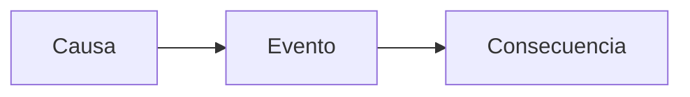

# 🏛️ {{title}}

**Qué pasó, en UNA frase:**

**Cadena causal (la memoria TDAH retiene historias, no listas de fechas):**

**3 fechas-bisagra (máximo 3):**
| Fecha | Qué | Por qué importa |
|---|---|---|
|  |  |  |

**Analogía Feynman:**
>

**Se conecta con:** [[ ]] · [[ ]]

---
- [ ] Repaso 48 h #repaso-48h #baja-energia
